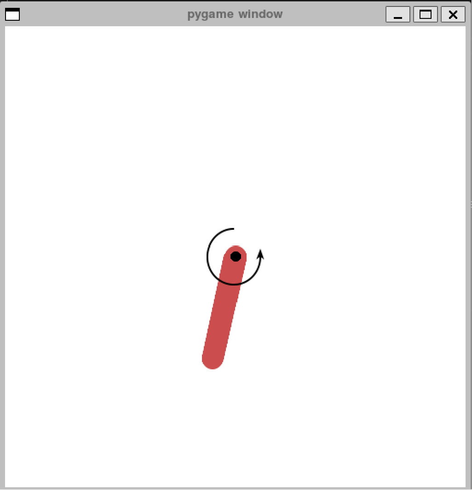

# A Simple Implementation of the Proximal Policy Optimization (PPO) Method

## Overview

This repository provides a basic implementation of the Proximal Policy Optimization (PPO) method from scratch. The implementation is based on the tutorial available at [Coding PPO from Scratch with PyTorch](https://medium.com/analytics-vidhya/coding-ppo-from-scratch-with-pytorch-part-1-4-613dfc1b14c8). The project focuses on using the Pendulum environment from the Atari games series. For more information about the Pendulum environment, refer to [this link](https://www.gymlibrary.dev/environments/classic_control/pendulum/). An example from the utilized environment can be seen as follows.




## Getting Started

### Clone the Repository

```bash
git clone https://github.com/SajjiKazemi/simple_PPO.git
```

## Dependencies
### 1. Using Docker:
Pull the pre-built container from Docker Hub:

```bash
docker-compose pull
```
Start the container:

```bash
docker-compose up -d
```
Activate the conda environment within the container:

```bash
conda activate ppo_env
```

### 2. Without Docker:
Create a virtual environment using the provided ppo_env.yml file:

```bash
conda env create -f ppo_env.yml
```
Activate the environment:

```bash
conda activate ppo_env
```

## Usage

To initiate training without rendering:

```bash
python main.py
```
To visualize rendering during training:

```bash
python main.py --render_mode human
```
To test the trained model:

```bash
python main.py --mode test --actor_model ppo_actor.pth --render_mode human
```

## Contact
For any questions or feedback, feel free to reach out:

Email: sajjikazemi@uwaterloo.ca

LinkedIn: www.linkedin.com/in/sajjadkazemi
